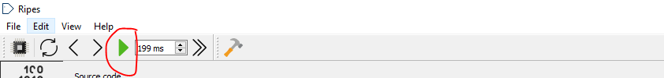
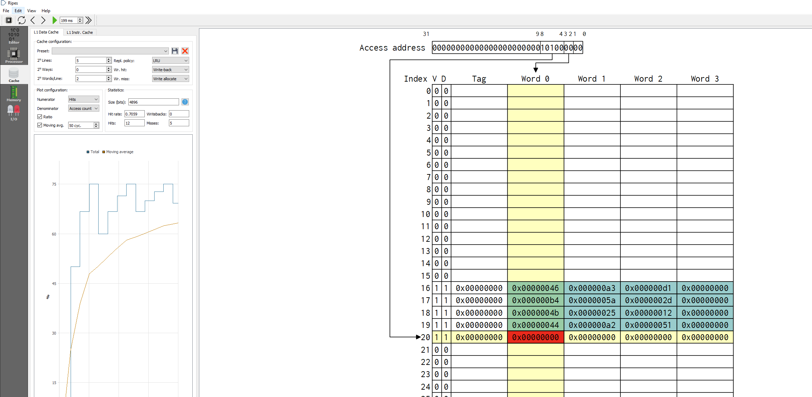

# LFSR-Pseudo-Random-Number-Generator
* 1. Descargue el programa [Ripes](https://github.com/mortbopet/Ripes/releases)

* 2. Abra el simulador
* 3. Cargue el archivo ejercicio.s -> click en `File` -> `Load Program`
* 4. Cambie el valor semilla como se muestra a continuación
```
li a1,<Hex value>
```
* 5. Ejecute el programa con el botón verde de `run`


* 6. Los valores aleatorios irán apareciendo en la pestalla de `Caché`




Pseudo Random Number Generator made using Assembly 